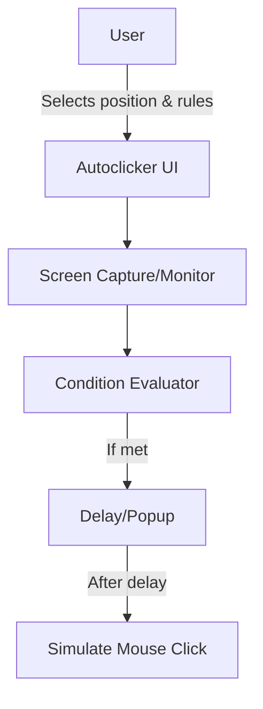

# Design Doc: Autoclicker

## Overview & Goals
The autoclicker is a desktop automation tool that monitors a user-selected screen position for specific features (color, text, etc.) and simulates a mouse click when user-defined conditions are met. It supports multiple conditions, logical rules (e.g., if 1 or 2 conditions are met), and a configurable delay or popup for user intervention.

## Architecture

## Tech Stack & Decisions
- Language: Python (for cross-platform desktop automation)
- Libraries:
	- PyAutoGUI (mouse/keyboard automation)
	- OpenCV (image/color detection)
	- pytesseract (OCR for text detection)
	- Tkinter or PyQt (UI for position selection and rule setup)
- Platform: macOS (primary), but design for cross-platform if possible

## Data Models / APIs
- **Condition**: { type: 'color' | 'text', position: (x, y), value: string | RGB, comparator: 'equals' | 'contains', ... }
- **Rule**: { conditions: [Condition], logic: 'any' | 'all' | 'n-of', n?: int }
- **Config**: { rules: [Rule], delay: int, popup: bool }

## Non-functional Requirements
- Low CPU usage when idle
- Responsive UI for setup
- Accurate detection (color tolerance, OCR tuning)
- Safe: user must be able to cancel before click (if delay/popup enabled)
- Log actions for debugging
